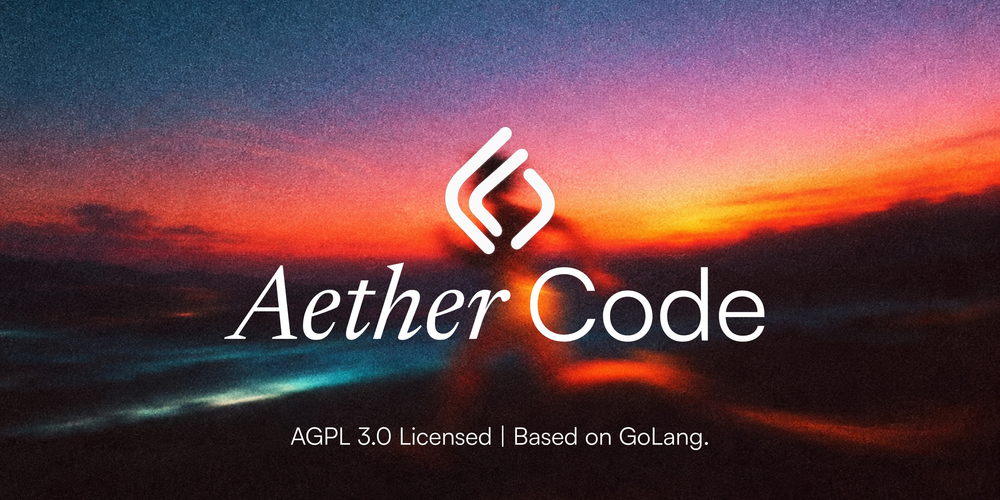

<p align="center">
  
</p>

# AetherCode

[](LICENSE)

AetherCode is an open-source coding-assessment platform for colleges: staff
write programming questions with hidden tests, students sit timed exams in a
HackerRank-style editor (optionally locked down in Safe Exam Browser), and
submissions are compiled and judged in a sandboxed code-execution engine.

It is built for supervised college lab exams and released under the
[GNU AGPL v3](LICENSE).

The repository holds two independent codebases:

| | Platform | Exam app v1 |
|---|---|---|
| **Path** | `backend/`, `deploy/`, `frontend/` | [`apps/exam-v1/`](apps/exam-v1/README.md) |
| **What it is** | Multi-tenant Go microservices with PostgreSQL row-level security, signed authorization capabilities, an isolated judge (Piston or Judge0) and Safe Exam Browser enforcement. Runs on one server with Docker Compose or on Kubernetes. | One Next.js app + PostgreSQL + a grading worker over Judge0 or Piston, deployed with Docker Compose behind nginx on one server. |
| **Status** | **The only backend going forward** (ADR-0017). Accounts, authoring, take-and-grade and SEB lockdown work end to end through the gateway; results, live operations and the web frontend are next. See the [roadmap](docs/roadmap.md). | **Frozen fallback**, feature-complete for a supervised lab exam; used for exams until the platform reaches parity, then removed. |
| **Start here** | [PLAN.md](PLAN.md), [docs/roadmap.md](docs/roadmap.md), [deploy/single-server](deploy/single-server/README.md) | [apps/exam-v1/README.md](apps/exam-v1/README.md) |

The split, and why it exists, is recorded in
[ADR-0016](docs/adr/0016-lean-exam-app-for-first-launch.md) and
[ADR-0017](docs/adr/0017-go-platform-as-the-only-backend.md). The two share
no code or database.

## Exam app v1

Everything a college needs to run a graded coding exam in a supervised lab:

- **Admin:**
  - CSV student import with generated passwords and printable login slips;
  - batch password reissue, faculty accounts, enable/disable;
  - a system status page (database, worker, engine, grading queue).
- **Faculty:**
  - questions with sample and hidden tests (typed, or imported from files or a
    HackerRank-style zip);
  - exams per batch with a time window and per-student duration;
  - question pools (each student draws one per slot);
  - lab lockdown: allowed networks, fullscreen gate, outside-paste blocking;
  - a live monitor with announcements, per-student extra time and regrading;
  - CSV export, result release, and a code-similarity report.
- **Students:**
  - a HackerRank-style exam screen in C, C++, Java or Python;
  - Run against samples, Submit against all tests, custom input;
  - per-test results, with hidden tests shown as pass/fail only;
  - autosave, a server-owned timer, and auto-submission at time-up.
- **Grading:**
  - a worker that compiles once and runs every test in one Judge0 job;
  - Piston and per-test fallbacks;
  - retries, crash recovery, and runs prioritised over submits.
- **Operations:**
  - Docker Compose with nginx, Postgres, Judge0, and 15-minute backups;
  - `pnpm engine-check` and `pnpm loadtest`.

```sh
make exam-check          # typecheck + unit tests
make exam-build          # production build
make exam-up             # full deployment (configure apps/exam-v1/deploy first)
```

**Before the first graded exam on a new server:**
1. Run `pnpm engine-check` inside the worker container. It must print "Engine OK".
2. Run a load test at the real student count.
3. Hold a mock exam in the lab.

Judge0 1.13 needs cgroup v1 on the host. The full deployment guide and every
rule (scoring, timing, visibility, limits) are in the
[app README](apps/exam-v1/README.md).

## Platform: repository layout

- `backend/services/`: independently deployable Go services (gateway,
  identity, tenant, user, question-bank, assessment, submission, judge, seb,
  notification, analytics).
- `backend/libs/pkg/`: shared, framework-neutral platform packages.
- `backend/libs/proto/`: the source of truth for internal gRPC contracts.
- `deploy/`: the single-server Docker Compose stack, Helm charts and database
  provisioning.
- `docs/`: architecture decision records, database documentation, runbooks,
  API output and the [roadmap](docs/roadmap.md).
- `frontend/`: reserved for the platform's Next.js frontend (not started).

Start with [the implementation plan](PLAN.md), [the documentation index](docs/README.md)
and [the roadmap](docs/roadmap.md), which also lists the production gates that
need infrastructure outside this repository.

## Security and database model

The User service is the canonical Casbin-backed authorization decision service.
Its private mTLS `authz/v1.Authorize` API issues a fresh, five-second,
database-audience-bound HMAC capability for each allowed request. A target
database validates that capability in `authz.set_context`, binds it to the
current PostgreSQL backend and transaction, and checks the local
authorization-revision projection under `FORCE ROW LEVEL SECURITY`. A failed
decision, expired capability, or projection lag denies access. The complete
contract is in [docs/database/authorization-context.md](docs/database/authorization-context.md).

Authorization recovery is fail closed as well. Each RLS-protected service
starts with its local authorization projection unavailable and, after an
outbox or authorization-consumer failure, writes a target-specific resync
request through its local outbox. The User service returns a manifest-verified
grant snapshot; the target reopens only after every item has been applied.
This prevents a stream-retention gap from silently retaining access after a
revocation.

Every stateful platform service owns one logical database in the three-node
platform PostgreSQL topology. Database owners are non-login roles; migrations,
applications, and authorization-projection workers use separate least-privilege
identities. Run migrations only as the service migrator after the role/database
provisioner has run. Authorization HMAC material is supplied by the approved
KMS/secret controller after bootstrap with
[`backend/scripts/provision-authz-context-key`](backend/scripts/provision-authz-context-key);
the script neither generates nor stores a secret.

The platform HA chart is deliberately render-gated on client certificates and
India-resident encrypted backup inputs. A successful render or install is not
HA acceptance: the node-failure and PITR exercises in
[the platform PostgreSQL runbook](deploy/runbooks/platform-postgres-ha.md) are
required before promotion.

## Judge boundary and release gate

Judge control-plane state is isolated in `aether_judge_wrapper` with its own
PostgreSQL HA deployment and RabbitMQ quorum cluster. It does not own or share
Redis with the platform; Redis is an internal dependency of the separately
operated Judge0 engine after approval. The wrapper accepts durable, encrypted
references and leases completions through private mTLS gRPC.

Implemented on the judge side:
- a real Judge0 HTTP client (`backend/services/judge/internal/adapters/judge0`), selected
  with `JUDGE_ENGINE` and only enabled when `JUDGE_ENGINE_COMPATIBILITY_APPROVED`
  is set;
- fan-out of an evaluation bundle into one execution unit per test case
  (ADR-0014);
- per-unit results surfaced to submission, with a candidate-versus-faculty
  visibility boundary (ADR-0015).

Submission dispatches each queued evaluation request and code run to Judge
over mTLS; Judge decrypts the bundle and source, runs one execution unit per
test case on the engine, and Submission scores the attempt by test weight
(ADR-0014, ADR-0015, ADR-0021). The single-server stack uses Piston by default
(ADR-0018).

The Judge0 engine chart is disabled by default. It must remain blocked until
the gVisor, no-network, non-privileged compatibility gate has approved an
immutable image and recorded queue-replay, node-failure, and 10,000-candidate /
five-minute load evidence, including the 60-second final-verdict P95 target.
See [the compatibility-gate runbook](docs/runbooks/judge0-compatibility-gate.md).

## Platform: current backend scope

Working end to end through the gateway (verified by
[`deploy/single-server/smoke.py`](deploy/single-server/smoke.py)):
- identity: login by username or roll number, MFA and recovery;
  administrator-provisioned accounts and CSV student import (ADR-0019);
- colleges, departments, batches, roles and placement affiliations;
- staff authoring into a global question bank with server-built, encrypted,
  weighted test bundles (ADR-0020); immutable question and exam versions;
  batch assignment;
- attempts with per-candidate deadlines, autosaved answers, Run against
  sample tests with full output (ADR-0021), submit, judging, weighted scoring
  and time-up auto-submission;
- Safe Exam Browser lockdown with per-URL key checks and `.seb` launch files
  (ADR-0022);
- in-app notifications, event-fed analytics projections, cursor-paginated
  lists and soft delete (ADR-0013).

The local MinIO and KMS adapters (`backend/libs/pkg/storage/minio`,
`backend/libs/pkg/kms/local`) are what the single-server stack uses. A
multi-college production deployment should use managed object storage and
KMS; see the production gates in the [roadmap](docs/roadmap.md).

## Platform: first run

A fresh deployment has no principals and no role assignments, so there is no way
to call any authenticated endpoint. Run the one-time bootstrap command to create
the first platform administrator after migrations are applied:

```sh
export IDENTITY_DATABASE_URL="postgres://..."
export USER_DATABASE_URL="postgres://..."
make bootstrap EMAIL=admin@college.edu NAME="Platform Admin"
```

The command creates the principal in the identity database and a self-granted
`super_admin` role assignment in the user database. **The created account has no
password.** Activate it by triggering the password-reset flow for the supplied
email address. No password is ever written, printed, or accepted by this
command.

The command is safe to re-run. A crash between the two database writes is
repaired by running it again — each half independently no-ops if its row already
exists. Once the platform has any principal or any `super_admin`, both functions
permanently refuse further calls.

## Platform: HMAC capability key rotation

`authz.context_keys` (present in the `analytics`, `assessment`, `identity`,
`notification`, `question-bank`, `seb`, `submission`, `tenant`, and `user`
databases — not `gateway` or `judge`, which have no such table) supports
zero-downtime rotation through overlapping `not_before`/`not_after`/`retired_at`
validity windows, but publishing and retiring a key still requires an operator
action. `make rotate-authz-key` targets exactly one database per invocation:

```sh
export DATABASE_URL="postgres://..."
make rotate-authz-key ACTION=publish AUDIENCE=aether_submission NOT_AFTER=2026-09-24T00:00:00Z
```

The command generates a new key ID (a UUIDv7, unless `KEY_ID` is supplied) and
32 bytes of random HMAC key material, inserts the row, and prints the key ID
and base64-encoded secret to stderr **exactly once**, with a clear warning that
it is the only time the secret is shown. The secret is never written to a file,
a log, or stdout. Copy it out-of-band into the target's operational secret
store before it is lost.

Full rotation procedure:

1. Publish a new key against all nine target databases, one invocation per
   database, with a `not-before` a few minutes in the future (the default) so
   already-deployed services have time to pick up the new configuration before
   the key becomes valid, and a `not-after` far enough out to cover the
   rotation window.
2. Wait until `not-before` has passed on every database, then confirm the new
   key works before relying on it.
3. Update `AUTHZ_CAPABILITY_KEYS` in the User service's configuration (the
   canonical signing service, per `backend/libs/pkg/authz`) to the new key.
4. Once confident no capability signed with the old key is still in flight —
   capabilities have a five-second TTL (`capabilityTTL` in
   `backend/libs/pkg/authz/capability.go`), so the safe window is generous — retire the
   old key on all nine databases:

```sh
export DATABASE_URL="postgres://..."
make rotate-authz-key ACTION=retire AUDIENCE=aether_submission KEY_ID=<old-key-id>
```

`retire` fails if the key is already retired or does not exist for that
audience. This CLI is for operational key rotation; the KMS-provisioned
first key for a freshly bootstrapped database still comes from
[`backend/scripts/provision-authz-context-key`](backend/scripts/provision-authz-context-key),
whose secret is supplied externally rather than generated locally.

## Local prerequisites

- **Exam app:** Node.js 24, pnpm 12, Docker. See
  [apps/exam-v1/README.md](apps/exam-v1/README.md#local-development).
- **Platform:** Go, Docker, GNU Make, Buf, and golangci-lint. The pinned
  `golang-migrate` runner is built through Go, so no separately installed
  migration CLI is needed. Copy `.env.example` to `.env` and replace development
  passwords before running the local stack.

## Common commands

```sh
# exam app
make exam-check
make exam-build
make exam-up            # / make exam-down

# platform
make dev-up
make dev-judge-up
make build
make test
make test-migrations
make lint
make migrate SVC=identity DIR=up
```

`make dev-up` starts the `platform` compose profile. `make dev-judge-up` starts
the isolated Judge control-plane profile using an untracked `.judge-control.env`
file; it intentionally does not start Judge0. `make test-integration` requires
Docker. Production credentials and database roles are provisioned through the
deployment configuration, never from this repository. The full command list is
in [CLAUDE.md](CLAUDE.md#commands).

## Contributing

Contributions are welcome: read [CONTRIBUTING.md](CONTRIBUTING.md) first, and
follow the [Code of Conduct](CODE_OF_CONDUCT.md). Report security issues
privately as described in [SECURITY.md](SECURITY.md), never in a public issue.

## License

Copyright (C) 2026 St. Joseph's Group of Institutions.

AetherCode is free software: you can redistribute it and/or modify it under the
terms of the [GNU Affero General Public License v3.0](LICENSE). If you run a
modified version as a network service, the AGPL requires you to offer its
users the corresponding source code. See [NOTICE](NOTICE).
