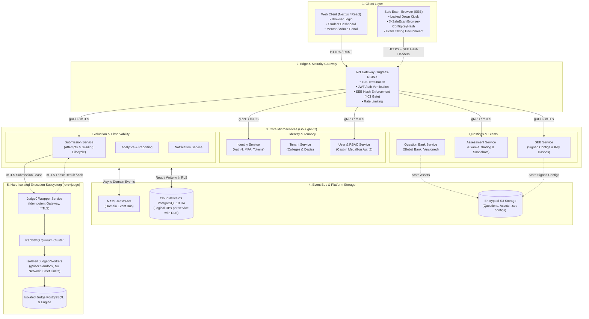

# AetherCode Platform Architecture

```mermaid
flowchart TB
    subgraph Clients["1. Client Layer"]
        WebApp["Web Client (Next.js / React)<br/>• Browser Login<br/>• Student Dashboard<br/>• Mentor / Admin Portal"]
        SEBClient["Safe Exam Browser (SEB)<br/>• Locked Down Kiosk<br/>• X-SafeExamBrowser-ConfigKeyHash<br/>• Exam Taking Environment"]
    end

    subgraph Edge["2. Edge & Security Gateway"]
        Gateway["API Gateway / Ingress-NGINX<br/>• TLS Termination<br/>• JWT Auth Verification<br/>• SEB Hash Enforcement (403 Gate)<br/>• Rate Limiting"]
    end

    subgraph PlatformServices["3. Core Microservices (Go + gRPC)"]
        direction TB
        subgraph AuthAndOrg["Identity & Tenancy"]
            Identity["Identity Service<br/>(AuthN, MFA, Tokens)"]
            Tenant["Tenant Service<br/>(Colleges & Depts)"]
            UserSvc["User & RBAC Service<br/>(Casbin Medallion AuthZ)"]
        end

        subgraph Assessments["Questions & Exams"]
            QBank["Question Bank Service<br/>(Global Bank, Versioned)"]
            Assessment["Assessment Service<br/>(Exam Authoring & Snapshots)"]
            SEBSvc["SEB Service<br/>(Signed Configs & Key Hashes)"]
        end

        subgraph Execution["Evaluation & Observability"]
            Submission["Submission Service<br/>(Attempts & Grading Lifecycle)"]
            Analytics["Analytics & Reporting"]
            Notification["Notification Service"]
        end
    end

    subgraph MessagingStorage["4. Event Bus & Platform Storage"]
        NATS["NATS JetStream<br/>(Domain Event Bus)"]
        PlatformDB[("CloudNativePG PostgreSQL 18 HA<br/>(Logical DBs per service with RLS)")]
        S3Storage[("Encrypted S3 Storage<br/>(Questions, Assets, .seb configs)")]
    end

    subgraph JudgeIsolation["5. Hard Isolated Execution Subsystem (role=judge)"]
        direction TB
        JudgeWrapper["Judge0 Wrapper Service<br/>(Idempotent Gateway, mTLS)"]
        RabbitMQ["RabbitMQ Quorum Cluster"]
        JudgeWorkers["Isolated Judge0 Workers<br/>(gVisor Sandbox, No Network, Strict Limits)"]
        JudgeDB[("Isolated Judge PostgreSQL & Engine")]

        JudgeWrapper --> RabbitMQ
        RabbitMQ --> JudgeWorkers
        JudgeWorkers --> JudgeDB
    end

    %% Client to Edge
    WebApp -->|HTTPS / REST| Gateway
    SEBClient -->|HTTPS + SEB Hash Headers| Gateway

    %% Gateway to Services
    Gateway -->|gRPC / mTLS| Identity
    Gateway -->|gRPC / mTLS| UserSvc
    Gateway -->|gRPC / mTLS| Assessment
    Gateway -->|gRPC / mTLS| Submission
    Gateway -->|gRPC / mTLS| SEBSvc

    %% Core Services interactions
    PlatformServices <-->|Async Domain Events| NATS
    PlatformServices <-->|Read / Write with RLS| PlatformDB
    QBank -.->|Store Assets| S3Storage
    SEBSvc -.->|Store Signed Configs| S3Storage

    %% Submission to Judge
    Submission -->|mTLS Submission Lease| JudgeWrapper
    JudgeWrapper -.->|mTLS Lease Result / Ack| Submission
```
